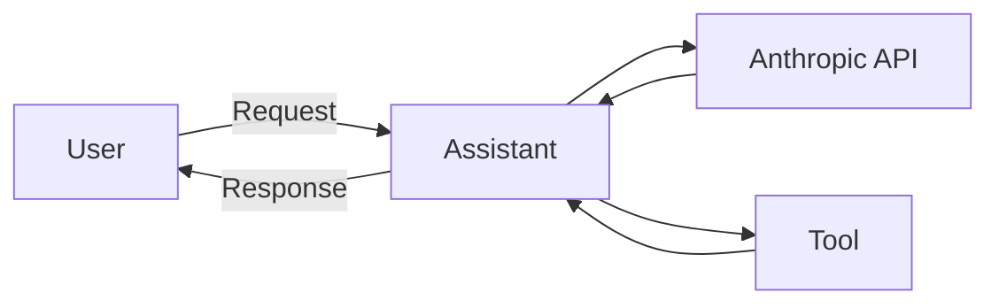

# Travel w/ SwAG 

Travel w/ SwAG is an assistant developed by the SwAG (**S**oft**w**are **A**gents doing **G**reat things) team. The assistant is designed to be a personalized travel assistant that can currently help with the following:

- Understanding & Navigating your current surroundings.
- Finding things to do.

The assistant is built on top of the Anthropic API, along with a series of tools that it can use to obtain the information it requires. It has a unique feature in that it uses SAM to segment images, allowing for a more interactive experience. The target audience for this is basically anyone, but is more aimed towards tourists or people who are new to an area.

Watch the demo & presentation:

[](https://www.youtube.com/watch?v=41-gEmVGCjk)

## Installation 

Before starting, you will need to setup your environment variables. Edit `.env.template` to do so.

The code (for now) is a simple FastAPI endpoint which is hit by the front-end. To run the code locally, you can follow the steps below:

```bash
git clone git@github.com:team-swag-dhst/llm-agents-berkeley.git && cd llm-agents-berkeley
python3 -m venv venv
source venv/bin/activate
pip install -r requirements.txt
python main.py
```

Then simply go to `localhost:8000/docs` to see the Swagger UI and test the API. You can use Postman, `test.py` or curl to test the API as well.


Currently our front-end is pointing at a webserver deployed through ngrok & a team members laptop. Therefore, it may be down at times. You can run the front-end locally (and therefore point it to `localhost:8000`) by following the steps below:

- open `frontend/src/config.ts`
- change BASE_URL to `http://localhost:8000`

Then run the following commands:

```bash
cd frontend
npm i
npm run start
```

## Backend Details

This section details the backend of the project.

We have a series of endpoints, that we will go through below.

### /sam

This a POST endpoint that takes in a image (as a base64 string) and a series of click (x, y) positions. It then uses `sam2.1_hiera_tiny` to mask (with a translucent blue) the most likely object within the image that the user is referring to.

### LLM Endpoints

These endpoints interact with our assistant, which is a wrapper around the Anthropic API, giving it access to a pre-defined set of tools. Our assistant code can be found under `swag/assistant.py`.

In short, the assistant does the following:
     - Takes in a user query.
     - Uses the Anthropic API to trigger Claude Sonnet 3.5.
     - For each block in the response, it either yields the text or triggers a tool call (depending on what Sonnet decides).
     - The tool call is then executed, and returned as a *user* back to sonnet.
     - This repeats until the stop_reason is no longer `tool_use`, i.e the model is happy with it's response.

Our prompts can either be found in `swag/prompts.py` as pydantic models (for the `/tourguide` endpoint) or in `main.py` as strings (for the `/query_assistant` endpoint). We used pydantic models for the `/tourguide` endpoint since it's easier to update and change the prompts for fast iterations.

#### /tourguide

This is a POST endpoint that triggers our feature called **the everywhere tour guide**. This takes in a set of inputs:

- `base_image`: The JPG image that the user is referring to (as a base64 string).
- `masked_image` (optional): The JPG image that the user is referring to, but with a SAM mask (as a base64 string).
- `location` (optional): The current location of the user as a string (such as: Kings Cross, London, United Kingdom).
- `lat`: The latitude of the user.
- `lon`: The longitude of the user.

The endpoint then triggers the assistant, which will return a series of messages that the user can use to navigate their surroundings.

#### /query_assistant

This is a POST endpoint that triggers our assistant. This takes in a set of inputs:

- `id`: The conversation ID.
- `lat`: The latitude of the user.
- `lon`: The longitude of the user.
- `query`: The user query.
- `query_type`: The type of query (either `restaurant`, `place` or `trip`).

The query type is used to shape the prompts that the assistant uses. `restaurant` and `place` are very similar, using the model to find nearby restaurants or places of interest. `trip` is a bit more complex, as it uses the model to plan a trip for the user, using optimization and various Google maps APIs to figure out the best route.

### Tools

We have a series of tools under `swag/tools.py`. Each of these have a Pydantic model associated with them which detail what they do. 

### Architecture

The architecture of the backend can be seen below:



## Frontend Details

The frontend side of the project is a React app that uses `react-chatbotify` to create a chatbot interface. This is hosted on the github pages of this repository or [here](https://team-swag-dhst.github.io/llm-agents-berkeley/), however it is currently pointing at a backend that may be down at times.

## TODO

- [ ] Allow for streaming of responses on front-end.
- [ ] Improve click detection on mobile.
- [ ] Implement tool retrieval to allow for unconstrained queries (under `/query_assistant`).
- [ ] Migrate to Gemini Flash for faster responses.
- [ ] Implement 'preference detection' so the assistant can learn from user preferences.
- [ ] Implement TTS for responses.
- [ ] Implement STT for queries.
- [ ] Migrate to using React Native for better mobile support.
- [ ] Implement pose detection so users can point at objects, rather than clicking.
- [ ] Buy a Apple Vision Pro :)
